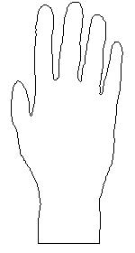
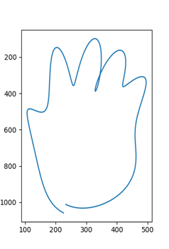

# Fourier Descriptor

### Implementation of Fourier descriptor by python

This program can convert image 1 to image 2.

1. Put the image link on the line 16 at fourier.py
2. Replace lines 12 and 13 at fourier.py with the origin of the polar coordinates of the image. The origin of polar coordinates is an arbitrary point in the area that goes around the image.
3. The degree of smoothing changes depending on N on the line 86 at fourier.py.

image1: drawn with black outline

image2: The result of N=7 version

